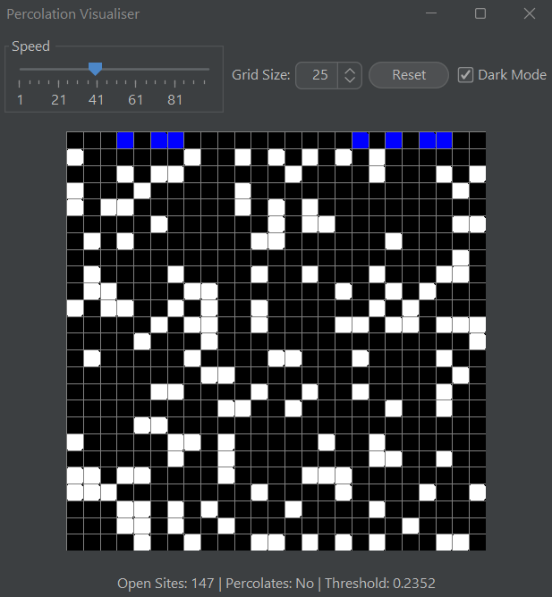
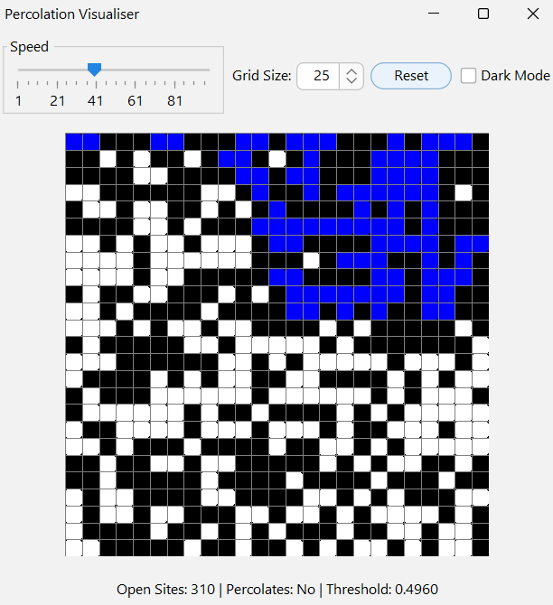
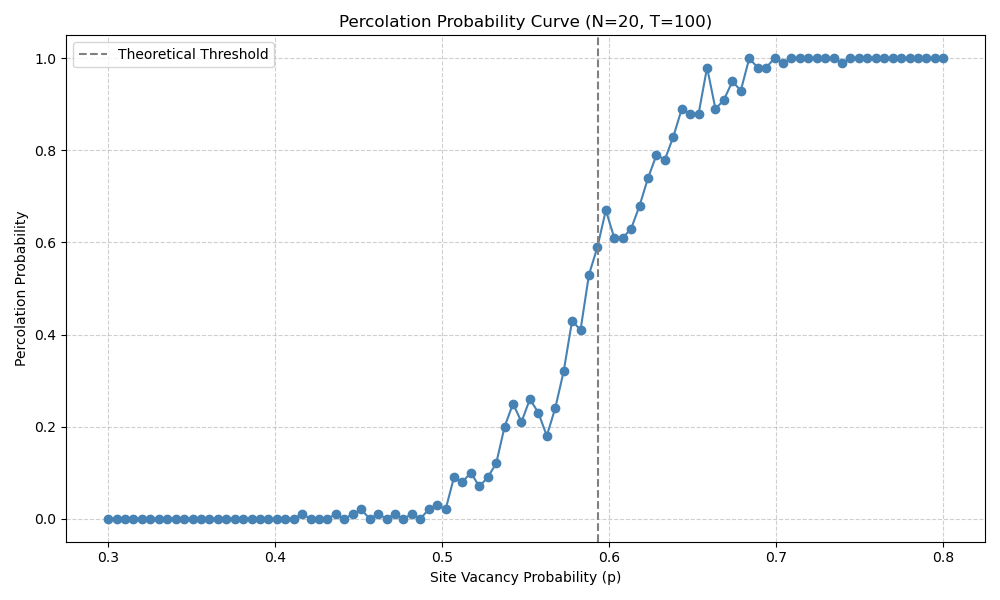

# 🧪 Monte Carlo Percolation Simulator (Java)

This project simulates **percolation in an N×N grid** using Monte Carlo methods, Union-Find data structures, multithreading, and a Swing GUI — all fully containerized with Docker.

---

## ✨ Features

**Percolation Simulation** using Union-Find  
**Monte Carlo Estimation** of percolation threshold  
**Multithreaded Execution** using `ExecutorService`  
**Swing GUI** with dark mode, reset, grid size & speed controls  
**Sigmoid Curve Plotting** using Python + Java  
**Dockerized Build** for easy deployment  
**Basic Tests** using Java assertions

---

## 📸 GUI Preview

  |  

---

## 🧠 How Percolation Works

Given an N×N grid where each site is either **open** or **blocked**, we say the system **percolates** if there’s a connected path from the top row to the bottom through open sites.

This simulator estimates the **critical threshold p\*** where percolation becomes likely (~0.593).

---

## 📈 Percolation Probability Curve

Using the Python plot script, we simulate the probability that an N×N grid percolates at different site vacancy probabilities `p`. The result is a sigmoid curve that approximates the **percolation threshold p\***.



---

## 🐳 Running with Docker

```bash
# Build Docker image
docker build -t percolation-app .

# Run simulation with grid size N=100, trials T=200
docker run percolation-app 100 200
